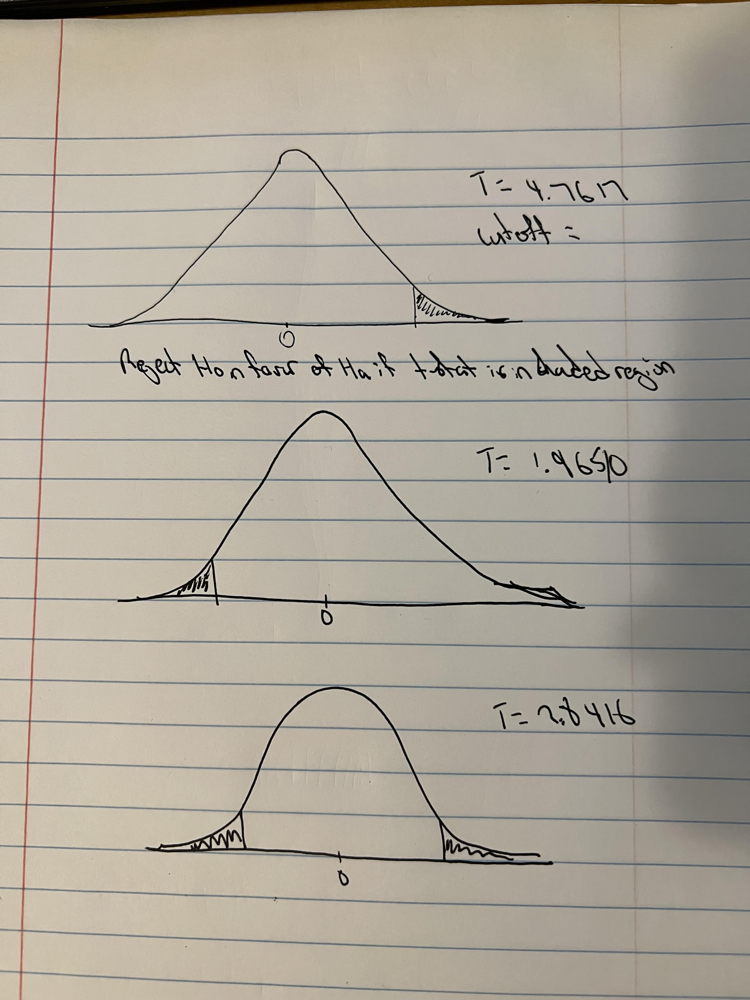

## Assignment:Perform hypothesis testing with this data and these hypotheses. Draw the distribution and rejection region by hand. Complete the hypothesis test manually, then use the function in R.



#### 2.5 1.9 3.0 -0.1 1.6 3.1 1.4 1.6 0.7 0.4

#### \* Ho: $\mu \le 0$

#### \* Ha: $\mu > 0$

```{r}
x <- c(2.5, 1.9, 3.0, -0.1, 1.6, 3.1, 1.4, 1.6, 0.7, 0.4)

risk_tolerance <- 0.05
mean_sample <- mean(x)
sd_sample <- sd(x)
n <- length(x)

(mean_sample - 0)/(sd_sample/sqrt(n))

cutoff <- qt(
  p = risk_tolerance,
  df = n - 1,
  lower.tail = FALSE
)
cutoff

t.test(
  x = x,
  alternative = "greater",
  mu = 0,
  conf.level = 0.95
)


```

### Reject Ho in favor Ha

### \_\_\_\_\_\_\_\_\_\_\_\_\_\_\_\_\_\_\_\_\_\_\_\_\_\_\_\_\_\_\_\_\_\_\_\_\_\_\_\_\_\_\_\_\_\_\_\_\_\_\_\_\_\_\_

#### \* Ho: $\mu \ge 0$

#### \* Ha: $\mu < 0$

#### -0.1 0.0 -0.6 -0.9 1.8 1.7 -0.2 2.0 1.2 2.0

```{r}
x <- c(0.1,0.0,-0.6,-0.9,1.8,1.7,-0.2,2.0,1.2,2.0)

risk_tolerance <- 0.05
mean_sample <- mean(x)
sd_sample <- sd(x)
n <- length(x)

(mean_sample - 0)/(sd_sample/sqrt(n))

cutoff <- qt(
  p = risk_tolerance,
  df = n - 1, 
  lower.tail = TRUE
)
cutoff

t.test(
  x = x,
  alternative = "less",
  mu = 0,
  conf.level = 0.95
)


```

### Fail to reject the null hypothesis.

### \_\_\_\_\_\_\_\_\_\_\_\_\_\_\_\_\_\_\_\_\_\_\_\_\_\_\_\_\_\_\_\_\_\_\_\_\_\_\_\_\_\_\_\_\_\_\_\_\_\_\_\_\_\_\_

#### \* Ho: $\mu = 0$

#### \* Ha: $\mu \ne 0$

#### -0.7 -0.3 1.8 2.2 2.3 0.4 -0.2 1.8 1.9 1.

```{r}
x <- c(-0.7,-0.3,1.8,2.2,2.3,0.4,-0.2,1.8,1.9,1)

risk_tolerance <- 0.05
mean_sample <- mean(x)
sd_sample <- sd(x)
n <- length(x)

(mean_sample - 0)/(sd_sample/sqrt(n))

cutoff_left <- qt(
  p = 0.05/2,
  df = n - 1,
  lower.tail = TRUE
)
cutoff_left

cutoff_right <- qt(
  p = 0.05/2,
  df = n - 1,
  lower.tail = FALSE
)
cutoff_right

t.test(
  x = x,
  alternative = "two.sided",
  mu = 0,
  conf.level = 0.95
)


```

### Reject Ho in favor Ha
